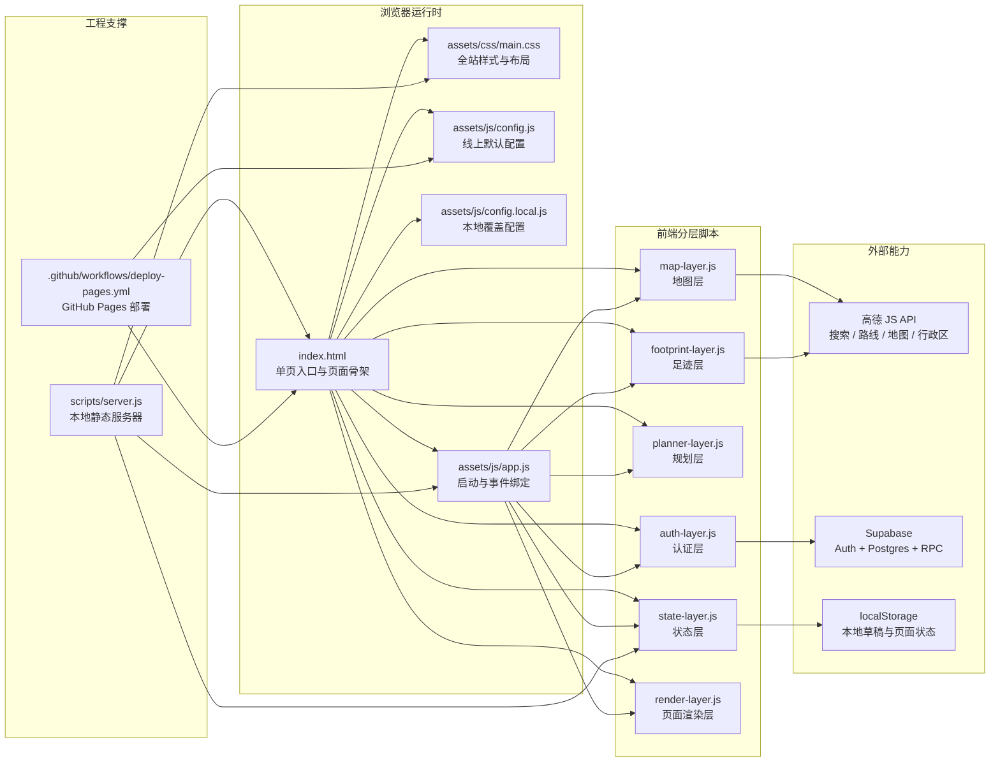
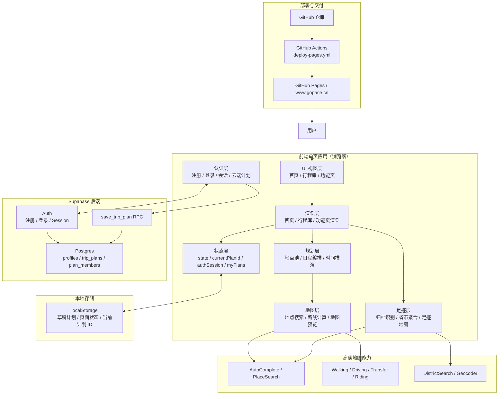

# 项目架构总览

本文用于梳理当前版本的文件职责、模块边界和主要数据流，方便后续继续迭代时快速定位改动入口。

## 1. 当前版本结构判断

当前项目本质上是一个部署在 GitHub Pages 上的前端单页应用，核心结构已经从“单个超大 `app.js`”整理为“分层脚本 + 轻量 bootstrap”。

当前版本的关键特点：

- `index.html` 是唯一页面入口，内部通过三个页面分区承载首页、行程库、功能页。
- `assets/js/app.js` 现在只负责启动流程和事件绑定，不再承担全部业务实现。
- `assets/js/modules/state-layer.js` 负责全局状态、运行时配置、通用格式化和本地存储能力。
- `assets/js/modules/auth-layer.js` 负责 Supabase 登录、账号信息、云端计划保存与计划管理。
- `assets/js/modules/planner-layer.js` 负责地点池、多日规划、拖拽、时间推演和计划结构维护。
- `assets/js/modules/map-layer.js` 负责高德地图加载、地点搜索、路线规划和功能页地图预览。
- `assets/js/modules/footprint-layer.js` 负责归档计划解析、足迹识别、足迹地图与省份详情面板。
- `assets/js/modules/render-layer.js` 负责首页、行程库、功能页等主要界面的渲染。

这次整理后，原来 `assets/js/app.js` 中多次重复定义的同名函数已经被收口，只保留当前最终生效的版本。

当前仍需注意的一点：

- 各层脚本目前仍通过浏览器全局作用域共享状态和函数，这是一次“先拆层、再继续解耦”的过渡结构。
- 它已经明显降低了单文件复杂度，但距离完全模块化的 ES Module 或状态容器方案还有一步。

## 2. 文件与代码关系图

## 3. 工程总体逻辑关系图

## 4. 关键链路说明

### 4.1 页面切换链路

- `index.html` 一次性加载首页、行程库、功能页三块页面区域。
- `assets/js/app.js` 中的 `bindEvents()` 负责把顶部导航、按钮、表单和地图交互绑定到各层函数。
- `render-layer.js` 中的 `setActivePage()` 控制页面显隐，并在需要时触发地图刷新。

### 4.2 本地草稿链路

- 用户在功能页修改旅行名称、日期、地点和日程时，数据先进入全局 `state`。
- `state-layer.js` 中的 `saveState()` 会把当前状态保存到 `localStorage`。
- 即使未登录，用户也可以先以本地草稿形式继续使用规划能力。

### 4.3 云端保存链路

- 用户登录后，`auth-layer.js` 通过 Supabase Auth 获得会话。
- 功能页点击“保存到云端”时，前端调用 `save_trip_plan` RPC。
- Supabase 将计划快照写入 `trip_plans`，前端随后刷新 `myPlans` 并更新当前绑定计划。
- 首页和行程库读取的计划列表，统一来自云端 `myPlans`。

### 4.4 地图与搜索链路

- 地点搜索由 `map-layer.js` 负责，先走高德 `AutoComplete`，无结果时回退到 `PlaceSearch`。
- 功能页地图预览使用高德地图和路线服务生成标记、折线和路程摘要。
- 足迹地图由 `footprint-layer.js` 从已归档计划的 `snapshot` 中提取地点，再通过行政区识别与反向地理编码生成省份与城市足迹。

### 4.5 渲染链路

- `render-layer.js` 负责首页、行程库、功能页的主要渲染工作。
- 首页渲染包含账号状态、当前计划 Spotlight、最近计划和足迹地图联动。
- 行程库渲染负责计划筛选、搜索、统计和计划卡操作。
- 功能页渲染负责地点池、日程卡片、地图摘要和候选地点建议列表。

### 4.6 部署链路

- 本地开发通过 `scripts/server.js` 提供静态服务。
- 线上发布由 `.github/workflows/deploy-pages.yml` 完成。
- 部署时工作流会把 `index.html`、`assets/`、`docs/`、`logo/` 等文件复制到 `dist/`，并生成线上版 `assets/js/config.js`。
- 最终站点发布到 GitHub Pages，并通过 `https://www.gopace.cn/` 对外访问。

## 5. 当前建议的后续整理方向

- 第一优先级已经完成：`app.js` 已按“状态层 / 认证层 / 规划层 / 地图层 / 足迹层 / 页面渲染层”拆为多个脚本。
- 第二优先级已经完成：原本同名函数的重复定义已清理，当前不再依赖“后定义覆盖前定义”的隐式行为。
- 第三优先级已完成第一阶段：首页、行程库、功能页的渲染逻辑已经从总控文件中移入 `render-layer.js`，总控文件只剩启动与事件绑定。

后续仍值得继续推进的方向：

- 把当前的全局共享变量进一步收敛为统一的状态容器，减少各层脚本之间的隐式耦合。
- 逐步从经典脚本切换到 ES Module，降低全局命名污染。
- 为 Supabase、地图和足迹识别补一层更明确的测试或调试入口，便于后续继续演进。
